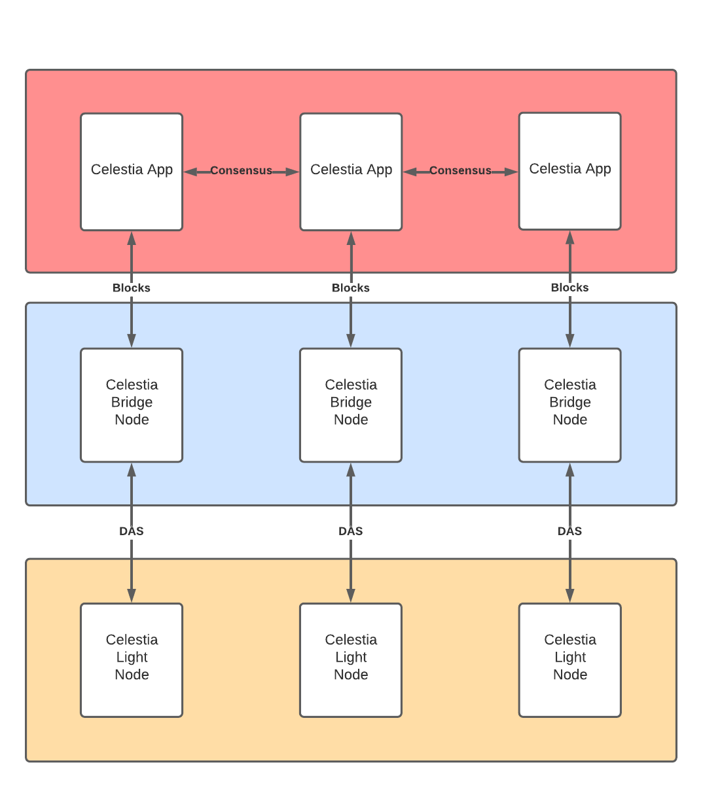
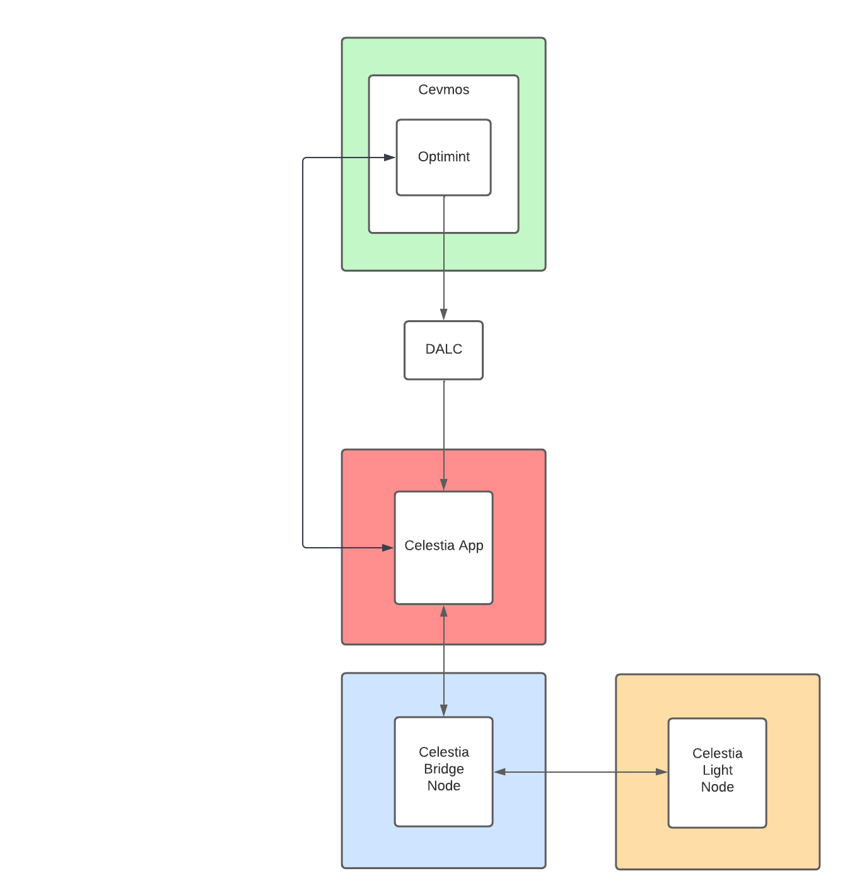

# Ephemeral Cluster

This repository contains configuration files and related scripts to starting Celestia and/or Ethermint clusters using docker compose 

## Dependencies
You must have both Docker and Docker Compose v2 installed

Install Docker: (https://docs.docker.com/engine/install/)  
Install Docker Compose: (https://docs.docker.com/compose/install/)

## Setup
 
Git doesn't store exact file permissions so the preexisting keys for the `core`, `bridge`, and `light` nodes need the correct permissions set manually.  
 
 The first time you setup the cluster run
 ```
chmod 0600 celestia-node/full/*/nodekey* && \
chmod 0600 celestia-node/light/*/nodekey* && \
chmod 0600 dalc/celestia-app/celestia-light-keys
```
This is done for you if you use the provided setup scripts in `scripts/`

There are 4 different options for clusters to run.

> ⚠️ Currently all clusters setup 4x core (celestia-app) nodes because I haven't created a different genesis config yet.

## Minimal Celestia Cluster

*Minimal Celestia Cluster*
```
scripts/minimal-celestia.sh
```

This is the most minimal cluster possible.
## Celestia Cluster w/ P2P Communication
```
scripts/p2p-celestia.sh
```


*Multi-node Celestia Cluster w/ P2P*


## Minimal Ethermint Cluster


*Minimal Ethermint Cluster*

To setup the docker compose cluster run
```
scripts/minimal-ethermint.sh
```

## Ethermint Cluster w/ P2P Communication
```
scripts/p2p-ethermint.sh
```


*Multi-node Ethermint Cluster w/ P2P*

# Cluster(s) Information

Each container in the cluster has its own static IP Address. Clusters with only a single instance of a given type use the lowest number in the range. 
| Component | IP Address |
| --------- | ---------- |
| Core Node(s) | 192.167.10.0 - 192.167.10.3 |
| Bridge Nodes(s) | 192.167.1.0 - 192.167.1.2 |
| Light Nodes(s) | 192.167.2.0 - 192.167.2.2 |
| DALC  | 192.167.3.0 |
| Ethermint | 192.167.4.0 |

### Interacting with the cluster

All containers run on the same docker compose network `docker_localnet`. The easiest way to reach a container is to run curl from a docker container within the network.

A single call to `core0` retrieving the first block:
```
docker run --network docker_localnet --rm curlimages/curl:7.80.0 -s "192.167.10.0:26657/block?height=1"
```

Docker compose also sets up DNS within the network so you can reference a given container by its name
```
docker run --network docker_localnet --rm curlimages/curl:7.80.0 -s "core0:26657/block?height=1"
```

To start an interactive session on a curl container
```
docker run -it --network docker_localnet curlimages/curl:7.80.0 bash
```

### Deploying a Smart Contract

> This assumes you're using one of the Ethermint clusters

First get the Ethermint validator's private key
```bash
export PRIV_KEY=$(scripts/val-priv-key.sh)
```

You can follow the logs for the `ethermint` container with

```bash
docker logs ethermint0 -f
```

We'll use https://github.com/gakonst/foundry for this

```bash
curl -L https://foundry.paradigm.xyz | bash
# Reload your path or do this in a new terminal
foundryup
```

Set your environment variables

```bash
export ETH_RPC_URL=http://127.0.0.1:8545
# And the PRIV_KEY from above
```

Create an example smart contract, I’ve been using the simple storage one

```solidity
pragma solidity >=0.7.0 <0.9.0;

/**
 * @title Storage
 * @dev Store & retrieve value in a variable
 */
contract Storage {

    uint256 number;

    /**
     * @dev Store value in variable
     * @param num value to store
     */
    function store(uint256 num) public {
        number = num;
    }

    /**
     * @dev Return value
     * @return value of 'number'
     */
    function retrieve() public view returns (uint256){
        return number;
    }
}
```

Set up a directory using `forge` in a new terminal

```bash
forge init hello_foundry
cd hello_foundry/src
ls .
```
There should be two files
```
Contract.sol  test
```
Replace `Contract.sol` with the above storage contract

```
forge build --force
forge create Storage --private-key=$PRIV_KEY
```

You should get something like

```bash
compiling...
no files changed, compilation skipped.
Deployer: 0xa2e2a047c2af7589294626c3d8220f56d49f01c4
Deployed to: 0xdcebe71fb4bad3f1d15451589700d08ce930b054
Transaction hash: 0x8bdeb6a753bff968a295638520c2d8dd2c1813adc8a93b722a13e91d1365197c
```

Grab the “Deployed to” address and save it to an env var

```bash
export CON_ADDR=0xdcebe71fb4bad3f1d15451589700d08ce930b054
```


### Interacting with the contract using `cast`

Get the initial storage value
```bash
cast call $CON_ADDR "retrieve()"
```
Returns
```
0x0000000000000000000000000000000000000000000000000000000000000000
```
Update the storage value to `1`
```
cast send $CON_ADDR "store(uint256)" 1 --private-key=$PRIV_KEY
```
Returns
```
blockHash            "0x33efb5b3baad6aa911aa8f89c5e82a799357d12665f619dec2560d66bd8f35dc"
blockNumber          "0x7"
contractAddress      null
cumulativeGasUsed    "0xa9fc"
effectiveGasPrice    "0xca47ef05"
gasUsed              "0xa9fc"
logs                 []
logsBloom            "0x00000000000000000000000000000000000000000000000000000000000000000000000000000000000000000000000000000000000000000000000000000000000000000000000000000000000000000000000000000000000000000000000000000000000000000000000000000000000000000000000000000000000000000000000000000000000000000000000000000000000000000000000000000000000000000000000000000000000000000000000000000000000000000000000000000000000000000000000000000000000000000000000000000000000000000000000000000000000000000000000000000000000000000000000000000000"
root                 null
status               "0x1"
transactionHash      "0x163366540f6ef1928f61054c8565482625fa6aaa61ecb8d5420b04751cb74e94"
transactionIndex     "0x0"
type                 "0x2"
```
Get the updated storage value
```
cast call $CON_ADDR "retrieve()"
```
Returns
```
0x0000000000000000000000000000000000000000000000000000000000000001
```

### Teardown

To stop the cluster run
```
scripts/teardown-docker-cluster.sh
```

<!-- (TODO): Using the Ethermint Debug Container -->